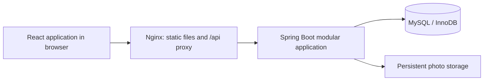

# Trim-Time: System Architecture

Status: planned architecture, not implemented infrastructure.

## Topology

Docker Compose runs Nginx/frontend, Spring Boot, and MySQL. Node/npm builds frontend assets; Node is not an additional production API server. During development, Vite proxies API traffic to the backend.

## Technology responsibilities

| Layer | Technologies | Responsibility |
| --- | --- | --- |
| Frontend | React, TypeScript, React Router | Screens, typed data, navigation, role-aware presentation |
| Frontend tooling | Vite, Node.js, npm, CSS Modules | Development, build, styles |
| HTTP client | Fetch API | JSON requests, cookies, CSRF token, error handling |
| Backend | Java, Spring Boot, Spring Web | REST endpoints and application services |
| Security | Spring Security, password encoder, sessions | Identity, permissions, ownership, CSRF |
| Persistence | JPA/Hibernate, Connector/J, MySQL/InnoDB | Relational persistence and transactions |
| Validation | Jakarta Bean Validation | Request validation plus domain checks in services |
| Schema | Flyway | Versioned migrations, including explicit constraints and indexes |
| Containers | Docker, Compose, Nginx, volumes | Repeatable runtime and persistent data |
| Tests | JUnit, Spring Boot/Security Test, Testcontainers MySQL | Backend correctness using real database semantics |
| UI tests | Vitest, React Testing Library | Key user interactions |
| Development | Maven, Git/GitHub, Postman | Build, version control, API inspection |

## Backend module boundaries

- identity: users, multiple roles per account, login, current-user context.
- salons: profiles, one-salon-per-owner ownership, photos, barber profiles, join requests and approved staff memberships.
- services: catalogue, add-ons, barber qualifications.
- availability: schedules, exceptions, candidate slot calculation.
- bookings: confirmation, lifecycle, cancellation, history.

Use controllers for HTTP handling, application services for workflows and transaction boundaries, repositories for persistence, and DTOs for external data. Do not expose JPA entities directly. Modules run in one deployable backend.

## API conventions (proposed)

| Endpoint family | Purpose |
| --- | --- |
| /api/auth/* | Register, login, logout, current identity, CSRF bootstrap |
| /api/salons | Public discovery and profile reads; protected owner writes |
| /api/salons/{id}/services | Catalogue management and reads |
| /api/salons/{id}/barbers | Staff, capabilities, schedules |
| /api/barber-profile | Create/read/update the authenticated applicant's profile |
| /api/barber-join-requests | Submit, inspect, or withdraw one's own salon join request |
| /api/salons/{id}/join-requests | Owner reads requests and approves/rejects them for their own salon |
| /api/availability | Candidate slots for a salon, services, and date |
| /api/bookings | Create booking; authorized, paginated history |
| /api/bookings/{id}/cancel | Policy-controlled cancellation |
| /api/bookings/{id}/status | Owner/barber permitted terminal transitions |

Exact paths and payloads are design proposals. Use consistent validation errors, 401 for missing authentication, 403 for prohibited operations, and 409 for booking conflicts. Conceal inaccessible record existence consistently where appropriate.

## Finalized identity flow

Normal registration grants CUSTOMER. Barber onboarding is self-service application followed by salon-owner approval, not an owner invitation. Approval updates membership, BARBER role, and authorization version atomically. Membership and schedule/service eligibility are checked independently before a barber is bookable.

Salon creation establishes SALON_OWNER and ownership together, with a database uniqueness rule preventing a second salon per owner. An owner may directly activate their own barber membership at their salon without applying. All accounts may retain multiple roles; privileged role names submitted by a client never directly grant authority. See [database design](04-Database-Design.md) for proposed storage and [access control](07-Access-Removal-Architecture.md) for lifecycle checks.

## Authentication and deployment

- Prefer same-origin frontend and /api routes via Nginx.
- Session identifier uses an HttpOnly cookie; production uses Secure and an appropriate SameSite setting.
- Keep CSRF protection for state-changing cookie-authenticated requests.
- Start with one backend instance and in-memory sessions. Restarting it requires users to log in again; durable sessions are not promised.
- Database and photo volumes outlive container replacement; volumes are not backups.
- Do not expose MySQL publicly. Development-only host access may be enabled locally.
- Use environment configuration for credentials and storage paths; secrets stay out of Git and images.
- Run Flyway before serving traffic and validate entity/schema agreement rather than auto-mutating the schema.

## Domain-specific infrastructure

Discovery uses coordinates and Haversine distance for a small dataset. A map/geocoder is not selected. Photo metadata is stored in MySQL; file bytes live in a mounted storage directory initially. Store generated filenames and serve only validated image content.

Booking correctness uses the shared locking protocol in [06](06-Sync-Engine-Design.md). MySQL must not be assumed to offer PostgreSQL-style interval exclusion constraints.

No Redis, message broker, microservices, external sync worker, or GitHub integration is required by the current scope.
