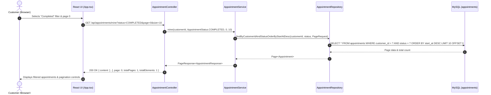

# Customer Appointment History: Pagination & Status Filtering Walkthrough

This document details the design, architecture, implementation, and verification of **Feature 10: Paginated & Filtered Customer Appointment History**.

---

## 1. Overview & Business Rationale

As customers book haircuts and styling sessions over months or years, an unpaginated flat list of historical appointments degrades both server performance and customer user experience. Furthermore, customers need the ability to quickly filter their appointments (e.g. reviewing only upcoming `CONFIRMED` appointments or auditing past `COMPLETED` appointments).

### Key Capabilities
1. **Status Filtering**: Query appointments matching specific lifecycle states (`CONFIRMED`, `IN_PROGRESS`, `COMPLETED`, `CANCELLED`, `NO_SHOW`), or retrieve all statuses when omitted.
2. **Page-Based Navigation**: Configurable page index and page size parameters, returning standard pagination metadata (`totalElements`, `totalPages`, `first`, `last`, `page`, `size`).
3. **Strict Customer Isolation**: Customers can only view and navigate their own appointments; appointments of other users are never accessible.
4. **Resilient Frontend UI**: Filter dropdown with readable status labels, page counters, previous/next controls, and backward-compatible payload parsing.

---

## 2. Architecture & Data Flow



---

## 3. Backend Implementation

### Repository Queries ([`AppointmentRepository.java`](file:///C:/Users/shub1/OneDrive/Desktop/Trim-Time/backend/src/main/java/com/trimtime/appointment/AppointmentRepository.java))
```java
Page<Appointment> findByCustomerIdOrderByStartAtDesc(Long customerId, Pageable pageable);

Page<Appointment> findByCustomerIdAndStatusOrderByStartAtDesc(
        Long customerId,
        AppointmentStatus status,
        Pageable pageable
);
```

### Generic Pagination DTO ([`AppointmentDtos.java`](file:///C:/Users/shub1/OneDrive/Desktop/Trim-Time/backend/src/main/java/com/trimtime/appointment/AppointmentDtos.java))
```java
public record PageResponse<T>(
        List<T> content,
        int page,
        int size,
        long totalElements,
        int totalPages,
        boolean first,
        boolean last
) {
    public static <T> PageResponse<T> from(Page<T> page) {
        return new PageResponse<>(
                page.getContent(),
                page.getNumber(),
                page.getSize(),
                page.getTotalElements(),
                page.getTotalPages(),
                page.isFirst(),
                page.isLast()
        );
    }
}
```

### Service Layer ([`AppointmentService.java`](file:///C:/Users/shub1/OneDrive/Desktop/Trim-Time/backend/src/main/java/com/trimtime/appointment/AppointmentService.java))
```java
@Transactional(readOnly = true)
public PageResponse<AppointmentResponse> mine(Long customerId, AppointmentStatus status, int page, int size) {
    int safePage = Math.max(0, page);
    int safeSize = Math.max(1, Math.min(size, 50));
    Pageable pageable = PageRequest.of(safePage, safeSize);

    Page<Appointment> appointmentPage = (status == null)
            ? appointmentRepository.findByCustomerIdOrderByStartAtDesc(customerId, pageable)
            : appointmentRepository.findByCustomerIdAndStatusOrderByStartAtDesc(customerId, status, pageable);

    return PageResponse.from(appointmentPage.map(this::toResponse));
}
```

### REST Controller ([`AppointmentController.java`](file:///C:/Users/shub1/OneDrive/Desktop/Trim-Time/backend/src/main/java/com/trimtime/appointment/AppointmentController.java))
```java
@GetMapping("/mine")
public PageResponse<AppointmentResponse> mine(
        Authentication authentication,
        @RequestParam(required = false) AppointmentStatus status,
        @RequestParam(defaultValue = "0") int page,
        @RequestParam(defaultValue = "10") int size
) {
    Long customerId = currentUserId(authentication);
    return appointmentService.mine(customerId, status, page, size);
}
```

### Exception Mapping ([`ApiExceptionHandler.java`](file:///C:/Users/shub1/OneDrive/Desktop/Trim-Time/backend/src/main/java/com/trimtime/system/ApiExceptionHandler.java))
Invalid query parameters (such as an unknown status value like `?status=FOOBAR`) are intercepted by `@ExceptionHandler(MethodArgumentTypeMismatchException.class)` and return a clear `400 Bad Request` Problem Detail (`"Invalid parameter value."`).

---

## 4. Frontend Implementation

### State & Loader ([`frontend/src/App.tsx`](file:///C:/Users/shub1/OneDrive/Desktop/Trim-Time/frontend/src/App.tsx))
- **Types**: Added `PageResponse<T>`.
- **State Hooks**:
  ```typescript
  const [appointments, setAppointments] = useState<Appointment[]>([])
  const [customerAppointmentStatus, setCustomerAppointmentStatus] = useState<string>('')
  const [customerAppointmentPage, setCustomerAppointmentPage] = useState<number>(0)
  const [customerAppointmentTotalPages, setCustomerAppointmentTotalPages] = useState<number>(0)
  const [customerAppointmentTotalElements, setCustomerAppointmentTotalElements] = useState<number>(0)
  const [customerAppointmentsBusy, setCustomerAppointmentsBusy] = useState<boolean>(false)
  const [customerAppointmentsError, setCustomerAppointmentsError] = useState<string>('')
  ```
- **Backward-Compatible Parsing**: Checks `Array.isArray(data)` vs `pageData.content` so legacy array payloads and mocked testing stubs continue to operate seamlessly alongside paginated Spring Data responses.
- **Interactive UI**:
  - Filter dropdown (`All statuses`, `Confirmed`, `In progress`, `Completed`, `Cancelled`, `No show`).
  - Active page indicator (`Page X of Y`).
  - Pagination navigation buttons (`Previous page`, `Next page`).
  - Clear filter button.

---

## 5. Verification & Automated Test Coverage

### Backend Integration Tests ([`CustomerAppointmentHistoryIT.java`](file:///C:/Users/shub1/OneDrive/Desktop/Trim-Time/backend/src/test/java/com/trimtime/appointment/CustomerAppointmentHistoryIT.java))
1. **`returnsCustomerAppointmentsWithPagination`**:
   - Creates 5 customer appointments on successive dates.
   - Paginates through page 0 (size 2), page 1 (size 2), and page 2 (size 2).
   - Verifies descending date order (`start_at DESC`), `totalElements = 5`, `totalPages = 3`.
2. **`filtersAppointmentsByStatus`**:
   - Creates `CONFIRMED`, `CANCELLED`, and `COMPLETED` appointments.
   - Queries each status specifically and validates exact status matching and total counts.
3. **`isolatesAppointmentsBetweenDifferentCustomers`**:
   - Creates appointments for two distinct customer accounts.
   - Asserts that customer A never sees customer B's appointments and vice versa.

### Frontend Component Tests ([`frontend/src/App.test.tsx`](file:///C:/Users/shub1/OneDrive/Desktop/Trim-Time/frontend/src/App.test.tsx))
- **`supports customer appointment pagination and status filtering`**:
  - Mocks paginated `/api/appointments/mine` with multi-page responses.
  - Verifies initial page load (`Page 1 of 2`).
  - Clicks `Next page` and verifies `Page 2 of 2` and updated appointment items.
  - Changes status dropdown to `COMPLETED` and asserts filtered list.
  - Clicks `Clear filter` and validates complete list restoration.
- All **19 tests** passing across the test suite with 0 linter warnings or errors.

### Live Docker Verification
Executed live via Docker containers on ports `8081` (backend) and `8088` (frontend):
- `GET /api/system/status` -> `UP` / `CONNECTED`.
- `GET /api/appointments/mine?page=0&size=5` -> `200 OK` with pagination metadata.
- `GET /api/appointments/mine?status=CONFIRMED&page=0&size=5` -> `200 OK`.
- `GET /api/appointments/mine?status=INVALID_STATUS` -> `400 Bad Request` with problem detail.

---

## 6. Summary of Roadmap Completion

All 6 requested roadmap features are now completely implemented, tested, verified, and deployed:
1. [x] **Barber Application Withdrawal** ([`Docs/34-Barber-Application-Withdrawal-Walkthrough.md`](file:///C:/Users/shub1/OneDrive/Desktop/Trim-Time/Docs/34-Barber-Application-Withdrawal-Walkthrough.md))
2. [x] **Salon Owner Self-Enrollment as Barber** ([`Docs/35-Salon-Owner-Self-Enrollment-Walkthrough.md`](file:///C:/Users/shub1/OneDrive/Desktop/Trim-Time/Docs/35-Salon-Owner-Self-Enrollment-Walkthrough.md))
3. [x] **Barber Membership Deactivation / Departure** ([`Docs/36-Barber-Membership-Deactivation-Walkthrough.md`](file:///C:/Users/shub1/OneDrive/Desktop/Trim-Time/Docs/36-Barber-Membership-Deactivation-Walkthrough.md))
4. [x] **Salon Photo Uploading, Storage & Gallery** ([`Docs/37-Salon-Photos-And-Gallery-Walkthrough.md`](file:///C:/Users/shub1/OneDrive/Desktop/Trim-Time/Docs/37-Salon-Photos-And-Gallery-Walkthrough.md))
5. [x] **Configurable Slot Increment & Advance Booking Horizon** ([`Docs/38-Slot-Increment-And-Booking-Horizon-Walkthrough.md`](file:///C:/Users/shub1/OneDrive/Desktop/Trim-Time/Docs/38-Slot-Increment-And-Booking-Horizon-Walkthrough.md))
6. [x] **Paginated / Filtered Customer Appointment History** ([`Docs/39-Customer-Appointment-History-Pagination-Filter-Walkthrough.md`](file:///C:/Users/shub1/OneDrive/Desktop/Trim-Time/Docs/39-Customer-Appointment-History-Pagination-Filter-Walkthrough.md))
